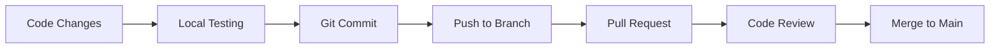
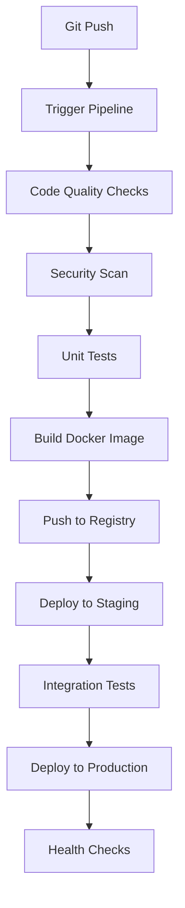
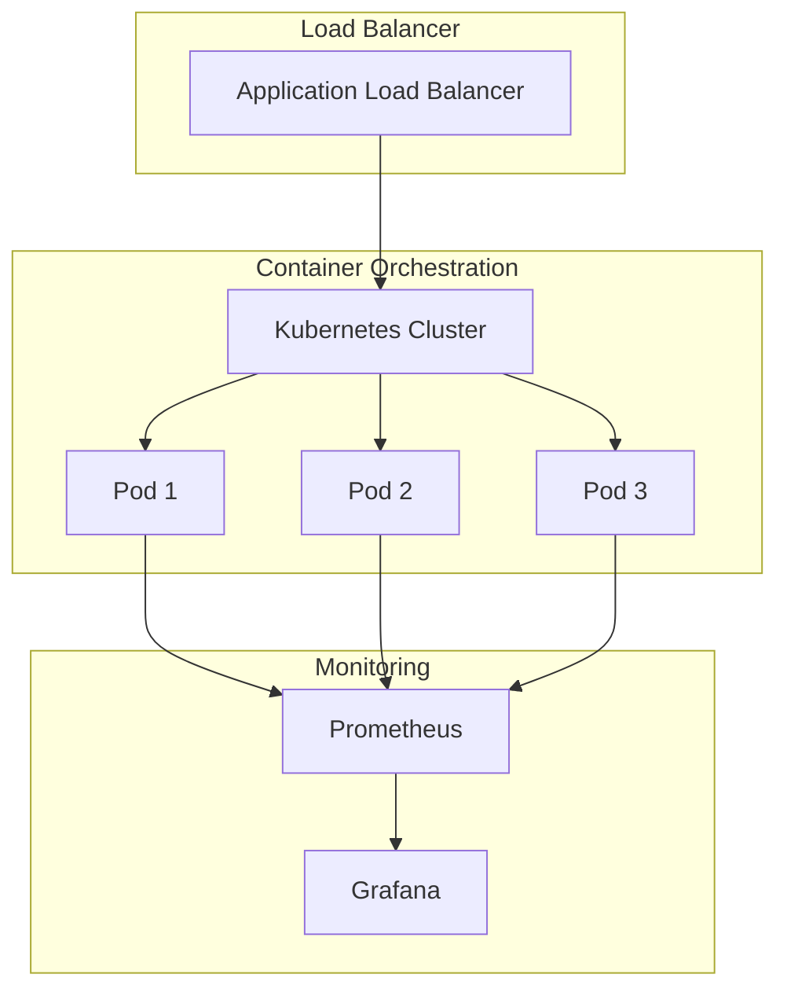

# 🚀 Space Defender Game - DevOps Learning Project

A complete DevOps-ready space-themed game built with HTML5, CSS3, and JavaScript, featuring a comprehensive CI/CD pipeline, containerization, and cloud deployment.


## 🎮 Game Overview

Space Defender is an engaging browser-based space shooter game where players defend Earth from alien invaders. The game features:

- **Stunning Visual Effects**: Animated starfield background, glowing effects, and particle explosions
- **Responsive Controls**: Smooth keyboard controls with arrow keys and spacebar
- **Progressive Difficulty**: Multiple levels with increasing challenge
- **Real-time Stats**: Live score, lives, and level tracking
- **Modern UI**: Futuristic design with CSS animations and transitions

### 🎯 Game Features

- **Player Ship**: Navigate with arrow keys, shoot with spacebar
- **Enemy Waves**: Randomly spawning enemies with different colors and speeds
- **Particle Effects**: Explosion animations when enemies are destroyed
- **Difficulty Levels**: Easy, Normal, and Hard modes
- **Pause/Resume**: Game state management
- **Health System**: Lives tracking with game over conditions
- **DevOps Dashboard**: Real-time deployment status display

## 🛠️ Technology Stack

### Frontend
- **HTML5**: Semantic markup and Canvas API for game rendering
- **CSS3**: Advanced styling with animations, gradients, and responsive design
- **JavaScript ES6+**: Modern JavaScript with classes and modules
- **Canvas API**: 2D graphics rendering for game objects

### DevOps & Infrastructure
- **Docker**: Containerization with multi-stage builds
- **Kubernetes**: Container orchestration with auto-scaling
- **Jenkins**: CI/CD pipeline automation
- **Terraform**: Infrastructure as Code for AWS
- **GitHub Actions**: Alternative CI/CD workflow
- **Nginx**: Web server with optimized configuration
- **Prometheus**: Monitoring and metrics collection
- **Grafana**: Visualization and dashboards

### Cloud Platforms
- **AWS**: ECS, ALB, CloudFront, VPC
- **Kubernetes**: Any managed Kubernetes service
- **Docker Hub/ECR**: Container registry

## 🚀 Quick Start

### Prerequisites

- **Docker** (v20.0+)
- **Docker Compose** (v2.0+)
- **Node.js** (v16.0+) - for development
- **kubectl** (for Kubernetes deployment)
- **Terraform** (v1.0+) - for infrastructure

### 1. Clone the Repository

```bash
git clone https://github.com/your-username/space-defender-game.git
cd space-defender-game
```

### 2. Run with Docker Compose (Recommended)

```bash
# Start the game with all services
docker-compose up -d

# Access the game
open http://localhost:8080
```

### 3. Run with Docker

```bash
# Build the image
docker build -t space-defender-game .

# Run the container
docker run -p 8080:8080 space-defender-game

# Access the game
open http://localhost:8080
```

### 4. Development Mode

```bash
# Install dependencies
npm install

# Start development server
npm run dev

# Access the game
open http://localhost:3000
```

## 📁 Project Structure

```
space-defender-game/
├── 🎮 Game Files
│   ├── index.html              # Main HTML file
│   ├── styles.css              # Game styling
│   ├── game.js                 # Game logic
│   └── package.json            # Node.js dependencies
│
├── 🐳 Docker Configuration
│   ├── Dockerfile              # Multi-stage Docker build
│   ├── docker-compose.yml      # Multi-service setup
│   └── nginx.conf              # Nginx configuration
│
├── 🔄 CI/CD Pipeline
│   ├── Jenkinsfile             # Jenkins pipeline
│   └── .github/workflows/      # GitHub Actions
│       └── ci-cd.yml
│
├── ☸️ Kubernetes Manifests
│   ├── k8s/
│   │   ├── namespace.yaml      # Kubernetes namespaces
│   │   ├── deployment.yaml     # Application deployment
│   │   ├── service.yaml        # Service configuration
│   │   ├── ingress.yaml        # Ingress controller
│   │   └── hpa.yaml            # Horizontal Pod Autoscaler
│
├── 🏗️ Infrastructure as Code
│   └── terraform/
│       ├── main.tf             # AWS infrastructure
│       ├── variables.tf        # Terraform variables
│       └── outputs.tf          # Infrastructure outputs
│
├── 📊 Monitoring
│   └── monitoring/
│       └── prometheus.yml      # Prometheus configuration
│
└── 📚 Documentation
    └── README.md               # This file
```

## 🔧 DevOps Workflow

### 1. Development Workflow



### 2. CI/CD Pipeline



### 3. Deployment Architecture



## 🚀 Deployment Guide

### Local Development

1. **Start Development Environment**
   ```bash
   npm run dev
   ```

2. **Run with Docker**
   ```bash
   docker-compose up -d
   ```

### Kubernetes Deployment

1. **Create Namespace**
   ```bash
   kubectl apply -f k8s/namespace.yaml
   ```

2. **Deploy Application**
   ```bash
   kubectl apply -f k8s/
   ```

3. **Check Deployment Status**
   ```bash
   kubectl get pods -n space-defender
   kubectl get services -n space-defender
   ```

4. **Access Application**
   ```bash
   kubectl port-forward service/space-defender-game 8080:80 -n space-defender
   ```

### AWS Deployment with Terraform

1. **Initialize Terraform**
   ```bash
   cd terraform
   terraform init
   ```

2. **Plan Infrastructure**
   ```bash
   terraform plan -var="environment=prod"
   ```

3. **Deploy Infrastructure**
   ```bash
   terraform apply -var="environment=prod"
   ```

4. **Get Application URL**
   ```bash
   terraform output application_url
   ```

### Jenkins Pipeline Setup

1. **Create Jenkins Job**
   - New Item → Pipeline
   - Pipeline script from SCM
   - Repository URL: Your Git repository
   - Script Path: `Jenkinsfile`

2. **Configure Credentials**
   - Docker registry credentials
   - Kubernetes config
   - AWS credentials (if using)

3. **Set Environment Variables**
   ```bash
   DOCKER_REGISTRY=your-registry.com
   KUBECONFIG=/path/to/kubeconfig
   AWS_REGION=us-west-2
   ```

## 📊 Monitoring & Observability

### Prometheus Metrics

The application exposes metrics at `/metrics` endpoint:

- **HTTP Request Duration**: Response time tracking
- **HTTP Request Count**: Request volume metrics
- **Application Health**: Health check status
- **Resource Usage**: CPU and memory utilization

### Grafana Dashboards

Access Grafana at `http://localhost:3000` (admin/admin123):

- **Application Dashboard**: Request metrics, response times
- **Infrastructure Dashboard**: Container and node metrics
- **Business Dashboard**: Game-specific metrics

### Health Checks

- **Liveness Probe**: `/health` endpoint
- **Readiness Probe**: Application startup verification
- **Startup Probe**: Initial health verification

## 🔒 Security Best Practices

### Container Security

- **Non-root User**: Containers run as non-root user (UID 1001)
- **Read-only Filesystem**: Root filesystem is read-only
- **Security Context**: Dropped capabilities and security constraints
- **Image Scanning**: Automated vulnerability scanning with Trivy

### Network Security

- **Security Groups**: Restricted ingress/egress rules
- **TLS Encryption**: HTTPS termination at load balancer
- **Network Policies**: Kubernetes network segmentation
- **Rate Limiting**: Request rate limiting at ingress

### Application Security

- **Content Security Policy**: XSS protection headers
- **CORS Configuration**: Cross-origin request restrictions
- **Input Validation**: Client-side input sanitization
- **Dependency Scanning**: Regular security audits

## 🧪 Testing Strategy

### Unit Tests

```bash
npm test
```

### Integration Tests

```bash
# Test Docker container
docker run --rm -p 8081:8080 space-defender-game &
curl -f http://localhost:8081/health
```

### Load Testing

```bash
# Using Apache Bench
ab -n 1000 -c 10 http://localhost:8080/

# Using k6 (if installed)
k6 run load-test.js
```

### Security Testing

```bash
# Dependency audit
npm audit

# Container scanning
trivy image space-defender-game:latest
```

## 🔧 Configuration

### Environment Variables

| Variable | Description | Default |
|----------|-------------|---------|
| `NODE_ENV` | Environment mode | `production` |
| `PORT` | Application port | `8080` |
| `LOG_LEVEL` | Logging level | `info` |

### Docker Configuration

- **Base Image**: `nginx:alpine`
- **Port**: `8080`
- **Health Check**: `/health` endpoint
- **User**: Non-root (nginx:1001)

### Kubernetes Configuration

- **Replicas**: 3 (configurable)
- **Resources**: 64Mi memory, 50m CPU (requests)
- **Auto-scaling**: 2-10 replicas based on CPU/memory
- **Rolling Updates**: Max surge 1, max unavailable 1

## 🚨 Troubleshooting

### Common Issues

1. **Container Won't Start**
   ```bash
   # Check logs
   docker logs space-defender-game
   
   # Check health
   docker exec space-defender-game curl -f http://localhost:8080/health
   ```

2. **Kubernetes Pod Issues**
   ```bash
   # Check pod status
   kubectl describe pod <pod-name> -n space-defender
   
   # Check logs
   kubectl logs <pod-name> -n space-defender
   ```

3. **Performance Issues**
   ```bash
   # Check resource usage
   kubectl top pods -n space-defender
   
   # Check metrics
   curl http://localhost:8080/metrics
   ```

### Debug Mode

Enable debug logging:
```bash
docker run -e LOG_LEVEL=debug -p 8080:8080 space-defender-game
```

## 🤝 Contributing

1. **Fork the Repository**
2. **Create Feature Branch**
   ```bash
   git checkout -b feature/amazing-feature
   ```
3. **Commit Changes**
   ```bash
   git commit -m 'Add amazing feature'
   ```
4. **Push to Branch**
   ```bash
   git push origin feature/amazing-feature
   ```
5. **Open Pull Request**

### Development Guidelines

- Follow JavaScript ES6+ standards
- Use semantic commit messages
- Add tests for new features
- Update documentation
- Ensure Docker builds successfully

## 📈 Performance Optimization

### Frontend Optimization

- **Asset Compression**: Gzip compression enabled
- **Caching**: Browser caching for static assets
- **Minification**: CSS and JavaScript minification
- **Lazy Loading**: Deferred loading of non-critical resources

### Backend Optimization

- **Connection Pooling**: Nginx connection optimization
- **Keep-Alive**: HTTP keep-alive connections
- **Compression**: Response compression
- **Caching Headers**: Appropriate cache control headers

### Infrastructure Optimization

- **Auto-scaling**: Horizontal pod autoscaling
- **Resource Limits**: Appropriate CPU/memory limits
- **Load Balancing**: Traffic distribution across pods
- **CDN**: CloudFront for global content delivery

## 📚 Learning Resources

### DevOps Concepts

- **Containerization**: Docker fundamentals and best practices
- **Orchestration**: Kubernetes concepts and operations
- **CI/CD**: Pipeline design and automation
- **Infrastructure as Code**: Terraform and CloudFormation
- **Monitoring**: Observability and alerting strategies

### Recommended Reading

- [Docker Best Practices](https://docs.docker.com/develop/dev-best-practices/)
- [Kubernetes Documentation](https://kubernetes.io/docs/)
- [Jenkins Pipeline Tutorial](https://www.jenkins.io/doc/book/pipeline/)
- [Terraform Getting Started](https://learn.hashicorp.com/terraform)
- [AWS Well-Architected Framework](https://aws.amazon.com/architecture/well-architected/)

## 📄 License

This project is licensed under the MIT License - see the [LICENSE](LICENSE) file for details.

## 🙏 Acknowledgments

- **Game Design**: Inspired by classic space shooter games
- **DevOps Practices**: Following industry best practices
- **Open Source**: Built with open-source technologies
- **Community**: Thanks to all contributors and learners

## 📞 Support

- **Issues**: [GitHub Issues](https://github.com/your-username/space-defender-game/issues)
- **Discussions**: [GitHub Discussions](https://github.com/your-username/space-defender-game/discussions)
- **Documentation**: This README and inline code comments

---

**Happy Gaming and Happy DevOps Learning! 🚀🎮**

Made with ❤️ for the DevOps community
